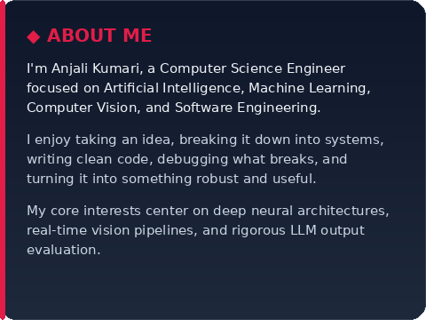
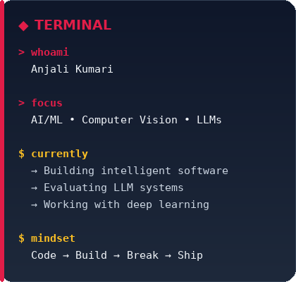
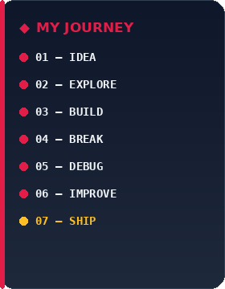
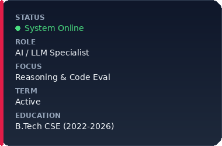
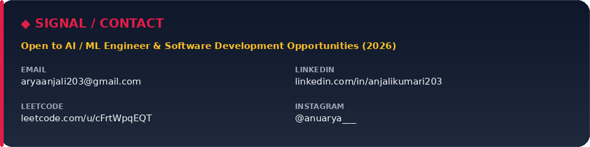

  

 

  
  &nbsp;
  
  &nbsp;
  
  &nbsp;
  

 

  

  

### ⛩️ 01 / ABOUT & TERMINAL

<table width="100%">
<tr>
<td width="42%" valign="top"></td>
<td width="36%" valign="top"></td>
<td width="22%" valign="top"></td>
</tr>
</table>

  

### 🌸 02 / WHAT I WORK WITH

<table width="100%">
<tr>
<td width="25%" valign="top">

#### ◆ 1. LANGUAGES
    

</td>
<td width="25%" valign="top">

#### ◆ 2. AI / ML
      

</td>
<td width="25%" valign="top">

#### ◆ 3. LLMs / GenAI
    

</td>
<td width="25%" valign="top">

#### ◆ 4. DATA & TOOLS
       

</td>
</tr>
</table>

 

  

  

### 📁 03 / SELECTED PROJECTS

<table width="100%">
<tr>
<td width="50%" valign="top">

### 🧠 [01 — Facial Emotion Detection](https://github.com/aryaanjalii203/Facial-Emotion-Detection)
> CNN-based facial emotion recognition pipeline trained on FER-2013 with OpenCV real-time boundary tracking.

    

</td>
<td width="50%" valign="top">

### 🤖 [02 — Chatbot](https://github.com/aryaanjalii203/Chatbot)
> An intent-based conversational agent designed to parse user queries, recognize context, and respond intelligently.

   

</td>
</tr>
<tr>
<td width="50%" valign="top">

### 🖼️ [03 — Image Classification](https://github.com/aryaanjalii203/Image_Classification)
> Fashion MNIST image classification using Histogram of Oriented Gradients (HOG) feature extraction and SVM.

    

</td>
<td width="50%" valign="top">

### ⚡ [04 — AI Automation & RecSys](https://github.com/aryaanjalii203)
> Full-stack Python automation pipelines with Streamlit, Google Drive sync, and collaborative recommendation systems.

   

</td>
</tr>
</table>

  <a href="https://github.com/aryaanjalii203?tab=repositories"><b>View all projects →</b></a>

  

### 💼 04 / EXPERIENCE & SIGNAL

<table width="100%">
<tr>
<td width="68%" valign="top">

#### 🎯 Handshake AI &mdash; AI / LLM Specialist *(Contract)*
- Evaluating frontier LLM outputs against strict technical and reasoning rubrics.
- Authoring reference solutions across algorithmic problems to improve training datasets and benchmark quality.
- Identifying edge cases, reasoning failures, and hallucinations across complex multi-step coding prompts.

</td>
<td width="32%" valign="top"></td>
</tr>
</table>

  

### 🧠 05 / CURRENTLY EXPLORING

  
  
  
  
  
  

 

> ⛰️ *"Don't just learn the technology. Build something with it."* &mdash; **Anjali Kumari**

  

### 📊 06 / TELEMETRY & ACTIVITY

  

 

  
  

  

### 📡 07 / SIGNAL & CONTACT

  

 

  
<b>BUILD INTELLIGENTLY. SHIP INTENTIONALLY.</b>

  
<small>— ANJALI KUMARI</small>

  

