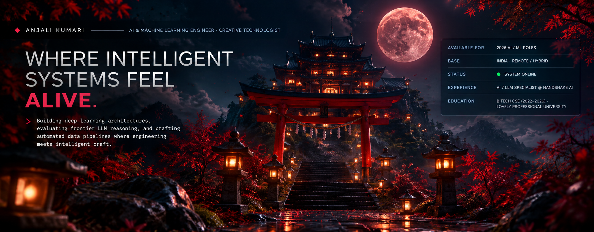

<div align="center">



<br/><br/>

<a href="https://www.linkedin.com/in/anjalikumari203/" target="_blank">

</a>
&nbsp;
<a href="https://leetcode.com/u/cFrtWpqEQT/" target="_blank">

</a>
&nbsp;
<a href="mailto:aryaanjali203@gmail.com">

</a>
&nbsp;
<a href="https://www.instagram.com/anuarya___/" target="_blank">

</a>

</div>

<br/>

---

# ⛩️ 01 / ABOUT & TERMINAL

<table width="100%">
<tr>

<td width="50%" valign="top">

### ⛩️ ABOUT ME

I'm **Anjali Kumari**, a Computer Science Engineer focused on **Artificial Intelligence, Machine Learning, Computer Vision, LLMs, and Software Engineering**.

I enjoy taking complex ideas, breaking them down into systems, writing the code, debugging what breaks, and turning them into useful software.

My work sits at the intersection of:

- Artificial Intelligence
- Machine Learning
- Deep Learning
- Computer Vision
- LLM Evaluation
- Python Automation
- Software Engineering

</td>

<td width="50%" valign="top">

```text
┌──────────────────────────────────────┐
│              TERMINAL                │
├──────────────────────────────────────┤
│                                      │
│ > whoami                             │
│ Anjali Kumari                        │
│                                      │
│ Computer Science                     │
│ AI / ML                              │
│ Software Engineering                 │
│                                      │
│ $ currently                          │
│ → Building software                  │
│ → Exploring AI & ML                  │
│ → Evaluating LLM systems              │
│ → Creating real projects             │
│                                      │
│ $ mindset                            │
│                                      │
│ Code → Build → Break                 │
│ → Improve → Ship                     │
│                                      │
└──────────────────────────────────────┘
